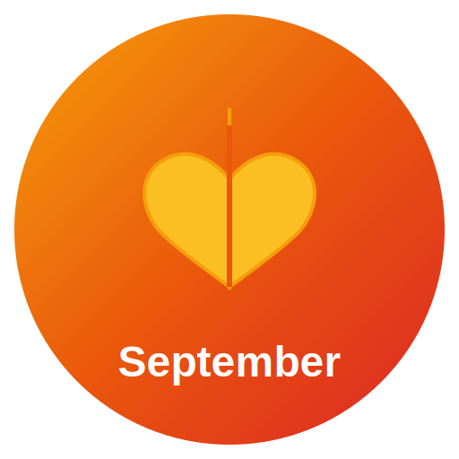

# 🎨 Mood Board - September Dashboard

<div align="center">


A polished glassmorphism productivity dashboard with mood board, calendar, Pomodoro timer, and focus tools.

[**🌐 Try it Online**](https://mood-board-topaz.vercel.app) • [**📥 Download**](https://github.com/AliHamzaAzam/mood_board/releases/latest) • [**📖 Documentation**](./electron-app/README.md)

</div>

---

## ✨ Features

### � Core Functionality
- **🍅 Pomodoro Timer** - Customizable focus/break intervals with audio notifications
- **📊 Statistics View** - Track your productivity over time with beautiful charts
- **📝 Notes & Tasks** - Organize your thoughts and to-dos
- **🎨 Mood Board** - Visual inspiration space
- **📅 Calendar** - Day/week/month views with event management

### 💎 User Experience
- **✨ Beautiful Glassmorphism UI** - Modern, translucent design
- **🌓 Dark Mode Support** - Easy on the eyes
- **⌨️ Keyboard Shortcuts** - Power-user friendly
- **🎆 Celebration Animations** - Celebrate your completed pomodoros!
- **💾 Persistent State** - Never lose your data (desktop app)
- **🖼️ Custom Titlebar** - Native feel across all platforms
- **📱 Responsive Design** - Works on any screen size

### 🔧 Technical Features
- Built with **React 18** and **Vite**
- Styled with **Tailwind CSS**
- Desktop app powered by **Electron**
- Charts with **Recharts**
- Local data persistence with **electron-store**
- PDF export capability

---

## 🌐 Try it Online

**[Launch Web App →](https://your-app.vercel.app)**

No installation required! Use the full-featured web version directly in your browser.

---

## 💾 Download Desktop App

Get the native desktop app for the best experience with data persistence and system integration.

### 🍎 macOS
```bash
# Download the DMG file
curl -L -o SeptemberDashboard.dmg https://github.com/azaleas/mood_board/releases/latest/download/September-Dashboard-1.0.0.dmg

# Or download manually:
```
**[Download September Dashboard.dmg](https://github.com/azaleas/mood_board/releases/latest)** → Open and drag to Applications

### 🪟 Windows
**[Download September-Dashboard-Setup.exe](https://github.com/azaleas/mood_board/releases/latest)** → Run the installer

### 🐧 Linux
- **AppImage** (Universal): [Download .AppImage](https://github.com/azaleas/mood_board/releases/latest)
  ```bash
  chmod +x September-Dashboard-*.AppImage
  ./September-Dashboard-*.AppImage
  ```
- **Debian/Ubuntu**: [Download .deb](https://github.com/azaleas/mood_board/releases/latest)
  ```bash
  sudo dpkg -i september-dashboard_*.deb
  ```
- **Snap**: [Download .snap](https://github.com/azaleas/mood_board/releases/latest)
  ```bash
  sudo snap install september-dashboard_*.snap --dangerous
  ```

---

## 📸 Screenshots

<div align="center">
  
  
  *Beautiful glassmorphism design with focus on productivity*
</div>

---

## ⌨️ Keyboard Shortcuts

| Action | macOS | Windows/Linux |
|--------|-------|---------------|
| Start/Pause Timer | `Cmd+Space` | `Ctrl+Space` |
| Reset Timer | `Cmd+R` | `Ctrl+R` |
| Skip to Break | `Cmd+B` | `Ctrl+B` |
| Open Settings | `Cmd+,` | `Ctrl+,` |
| Toggle Statistics | `Cmd+S` | `Ctrl+S` |
| Show Shortcuts | `Cmd+/` | `Ctrl+/` |

*See all shortcuts: Press `Cmd+/` (macOS) or `Ctrl+/` (Windows/Linux)*

---

## 🛠️ Development

### Prerequisites
- **Node.js** 20 or higher
- **pnpm** (Install with `npm install -g pnpm`)

### Quick Start

1. **Clone the repository**
   ```bash
   git clone https://github.com/azaleas/mood_board.git
   cd mood_board/electron-app
   ```

2. **Install dependencies**
   ```bash
   pnpm install
   ```

3. **Run development server**
   
   **Web version:**
   ```bash
   pnpm run dev
   ```
   Open http://localhost:5173
   
   **Electron app:**
   ```bash
   pnpm run electron:dev
   ```

### Build Commands

**Web Application:**
```bash
pnpm run build:web          # Build for web deployment
pnpm run preview            # Preview production build
```

**Desktop Application:**
```bash
pnpm run electron:build        # Build for current platform
pnpm run electron:build:mac    # Build for macOS (.dmg, .zip)
pnpm run electron:build:win    # Build for Windows (.exe)
pnpm run electron:build:linux  # Build for Linux (.AppImage, .deb, .snap)
```

### Project Structure
```
mood_board/
├── electron-app/
│   ├── src/
│   │   ├── components/     # React components
│   │   │   ├── PomodoroTimer.jsx
│   │   │   ├── StatisticsView.jsx
│   │   │   ├── SeptemberDashboard.jsx
│   │   │   └── ...
│   │   ├── hooks/          # Custom React hooks
│   │   ├── App.jsx         # Main app component
│   │   └── main.jsx        # Entry point
│   ├── electron/
│   │   ├── main.js         # Electron main process
│   │   └── preload.js      # Preload script
│   ├── assets/             # Icons and images
│   └── public/             # Static assets
├── .github/
│   └── workflows/
│       └── build.yml       # CI/CD automation
└── README.md
```

### Tech Stack
- **Frontend**: React 18, Vite 5
- **Styling**: Tailwind CSS 3, Custom Glassmorphism
- **Desktop**: Electron 31
- **Charts**: Recharts
- **Icons**: Lucide React
- **State**: React Hooks + electron-store
- **Build**: Vite + electron-builder

---

## 📦 Creating a Release

### Automated Release (Recommended)

1. **Update version** in `electron-app/package.json`
   ```json
   {
     "version": "1.1.0"
   }
   ```

2. **Commit and create a tag**
   ```bash
   git add electron-app/package.json
   git commit -m "Bump version to 1.1.0"
   git tag v1.1.0
   ```

3. **Push to GitHub**
   ```bash
   git push origin main
   git push origin v1.1.0
   ```

4. **Wait for GitHub Actions** (~10-15 minutes)
   - Builds are created for macOS, Windows, and Linux
   - A new release is published automatically
   - Downloads are available at: `https://github.com/azaleas/mood_board/releases/latest`

### Manual Local Build

```bash
cd electron-app
pnpm run electron:build
```

Builds will be in `electron-app/dist-electron/`

---

## 🤝 Contributing

Contributions are welcome! Please feel free to submit a Pull Request.

1. Fork the repository
2. Create your feature branch (`git checkout -b feature/AmazingFeature`)
3. Commit your changes (`git commit -m 'Add some AmazingFeature'`)
4. Push to the branch (`git push origin feature/AmazingFeature`)
5. Open a Pull Request

---

## 📝 Documentation

- [Design System](./electron-app/DESIGN_SYSTEM.md) - UI/UX guidelines
- [Pomodoro Guide](./electron-app/POMODORO_GUIDE.md) - Timer usage
- [Keyboard Shortcuts](./electron-app/KEYBOARD_SHORTCUTS.md) - All shortcuts
- [Statistics View](./electron-app/STATISTICS_VIEW.md) - Analytics features
- [Quick Start](./electron-app/QUICKSTART.md) - Getting started guide

---

## 🐛 Known Issues & Troubleshooting

### macOS
- If you see "App is damaged" error, run: `xattr -cr /Applications/September\ Dashboard.app`

### Windows
- Windows Defender may flag the installer - this is a false positive for unsigned apps

### Linux
- AppImage requires FUSE: `sudo apt install fuse libfuse2`

---

## 🔮 Roadmap

- [ ] Cloud sync (optional)
- [ ] Mobile apps (iOS/Android)
- [ ] Plugin system
- [ ] Themes marketplace
- [ ] Team collaboration features
- [ ] Integration with task managers (Todoist, Notion, etc.)

---

## 📄 License

MIT License - see [LICENSE](LICENSE) file for details

---

## 👨‍💻 Author

**Azalea**
- GitHub: [@azaleas](https://github.com/azaleas)

---

## 🙏 Acknowledgments

- Icons by [Lucide](https://lucide.dev/)
- Design inspired by modern glassmorphism trends
- Built with ❤️ using React and Electron

---

<div align="center">

**[⬆ Back to Top](#-mood-board---september-dashboard)**

Made with ☕ and 🎵

</div>
